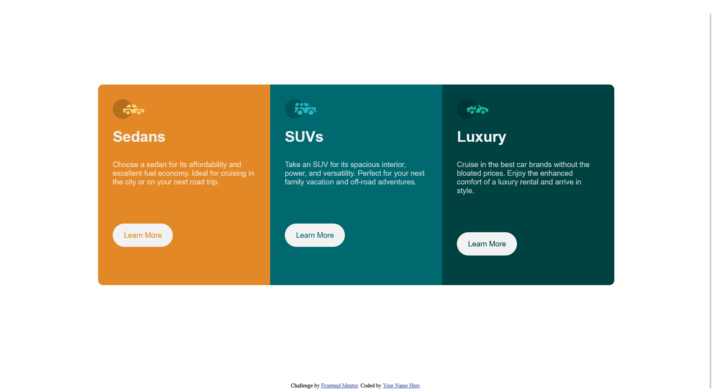

# Frontend Mentor - 3-column preview card component solution

This is a solution to the [3-column preview card component challenge on Frontend Mentor](https://www.frontendmentor.io/challenges/3column-preview-card-component-pH92eAR2-). Frontend Mentor challenges help you improve your coding skills by building realistic projects. 

## Table of contents

- [Overview](#overview)
  - [The challenge](#the-challenge)
  - [Screenshot](#screenshot)
  - [Links](#links)
- [Author](#author)
- [Acknowledgments](#acknowledgments)

## Overview

### The challenge

Users should be able to:

- View the optimal layout depending on their device's screen size
- See hover states for interactive elements

### Screenshot

### Links

- Solution URL: https://github.com/ManaIsrael/3-column-preview-card-component-main/

## My process

### Built with

- Semantic HTML5 markup
- CSS custom properties
- Flexbox
- CSS Grid
- Mobile-first workflow
- [React](https://reactjs.org/) - JS library
- [Next.js](https://nextjs.org/) - React framework
- [Styled Components](https://styled-components.com/) - For styles

**Note: These are just examples. Delete this note and replace the list above with your own choices**

## Author

- Frontend Mentor - [@manaisrael](https://www.frontendmentor.io/profile/manaisrael)
- Twitter - [@betelhemyemane3](https://twitter.com/betelhemyemane3)

## Acknowledgments

I Always Love to Acknowledge Mother of God Saint Virgin Mary, I wouldn't even know what my passion and luck is if I hadn't prayed unto her. Next I would Love to acknowledge my Mother Sara fekadu who encouraged me to keep up with my passion, without her advice, I wouldn't be here doing web development rather I would only just care about my GPAs.
